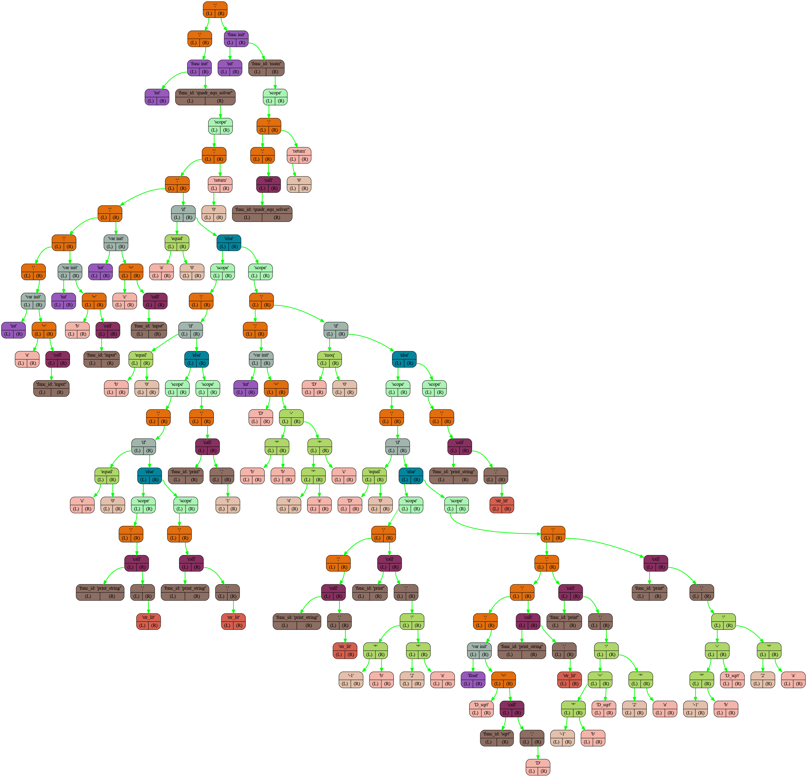

# OptimaLang

## Overview
**OptimaLang** — это Turing-полный язык программирования с Си-подобным синтаксисом. При компиляции код на языке OptimaLang преобразуется в промежуточное AST-представление, транслируется в инструкции для моего ассемблера, затем ассемблируется в исполняемый файл для моего эмулятора процессора.

## Features
- **Языковые структуры**: Поддержка рекурсии, циклов, условных переходов, функций.
- **Локальные переменные**: Управление областью видимости, поддержка чисел и строковых литералов
- **Графическое представление AST**:
  Генерирует картинку с AST деревом
- **Многоэтапная компиляция**:
  Исходный код -> AST -> Ассемблерный код -> Исполняемый файл


## Requirements
- make (для сборки)
- GCC (для компиляции SPU, SPU-assembler, BackEnd, FrontEnd)

## Installation
```bash
# 1. Клонировать репозиторий
git clone https://github.com/I1Va/OptimaLang.git
cd OptimaLang
# 2. Подгрузить все необходимые модули
git submodule update --init --remote --recursive
```

## Warning
Перед использованием стоит учесть особенности языка **OptimaLang**
* Не поддреживаются строковые литералы, содержащие пробелы
* После каждого блока в фигурных скобках нужно ставить ';'
* Тип функций void не поддерживается
## Usage
Создайте в корневой папке проекта файл, в котором будете писать код для **OptimaLang**


Опишу команды компиляции на примере файла **code.ol**
(**.ol** - расширение для языка **OptimaLang**)
1) Компиляция
    ```bash
    ./run.sh -C code.ol
    # Будет создан бинарный файл code.out
    ```
2) Исполнение бинарного файла
    ```bash
    ./run.sh -E code.out
    # Будет запущен code.out на виртуальном процессоре
    ```

3) Трансляция в ассемблерный код
    ```bash
    ./run.sh -S code.ol
    # Будет создан файл code.asm с ассемблерным кодом
    ```
4) Генерация AST представления
    ```bash
    ./run.sh --AST code.ol
    # Будет создан файл code.AST с AST представлением
    ```
5) Генерация картинки с AST представлением
    ```bash
    ./run.sh --AST --graphics code.ol
    # Будет создан файл code_AST.png с графическим представлением AST дерева
    ```

## Examples
Разработаю программу для решения квадратного уравнения


```c++
// code.ol
int quadr_equ_solver() {
    int a = input();
    int b = input();
    int c = input();
    if (a == 0) {
        if (b == 0) {
            if (c == 0) {
                print_string("infinity_roots");
            } else {
                print_string("zero_roots");
            };
        } else {
            print(1);
        };
    } else {
        int D = b * b - 4 * a * c;
        if (D >= 0) {
            if (D == 0) {
                print_string("one_root:");
                print(-1 * b / (2 * a));
            } else {
                float D_sqrt = sqrt(D);
                print_string("two_roots:");
                print((-1 * b + D_sqrt) / (2 * a));
                print((-1 * b - D_sqrt) / (2 * a));
            };
        } else {
            print_string("zero_roots");
        };
    };

    return 0;
};

int main() {
    quadr_equ_solver();
    return 0;
};
```

```bash
./run.sh -S code.ol
```
После трансляции:
```asm
;#=========Function========#
jmp quadr_equ_solver_end:;
quadr_equ_solver:
;#=======Input=Action======#
push rbp;
pop rbx;
push rsp;
pop rbp;
;#=======End=Action========#

;#=========Init=Args=======#
push rbx;
;#========End=Init=========#

;#========Func=Body========#
in; call input
; // 'a' init, loc_addr: 0
push rsp;
push 1;
add;
pop rsp; stack_ptr++
;#====Init_Var=Assinment===#
pop [rbp+0]; // 'a' assinment
;#======End=Assinment======#
in; call input
...

```

```bash
./run.sh --AST --graphics code
```
Представление в виде AST дерева:



## Project Structure
Здесь приведено очень краткое изложение структуры проекта

### FrontEnd
FrontEnd - часть проекта, состоящая из лексера и парсера. В этой части происходит создание AST дерева.
В реализации парсера используется алгоритм рекурсивного спуска, определяемый граматическими правилами (см examples/Grammar.cpp)
Вот пример одного граматического правила
```c++
// get_statement:
//     | get_function_initialization
//     | get_while
//     | get_cont_ret_break
//     | get_function_call
//     | get_assignment
//     | get_variable_initialization_with_assignment
//     | get_variable_initialization
//     | get_expression
//     | get_selection_statement
```

### BackEnd
BackEnd - часть проекта, состоящая из транслятора, который преобразует AST представление в ассемблерные инструкции. Для работы с локальными переменными и аргументами функции транслятор использует механизм стэкового фрэйма
